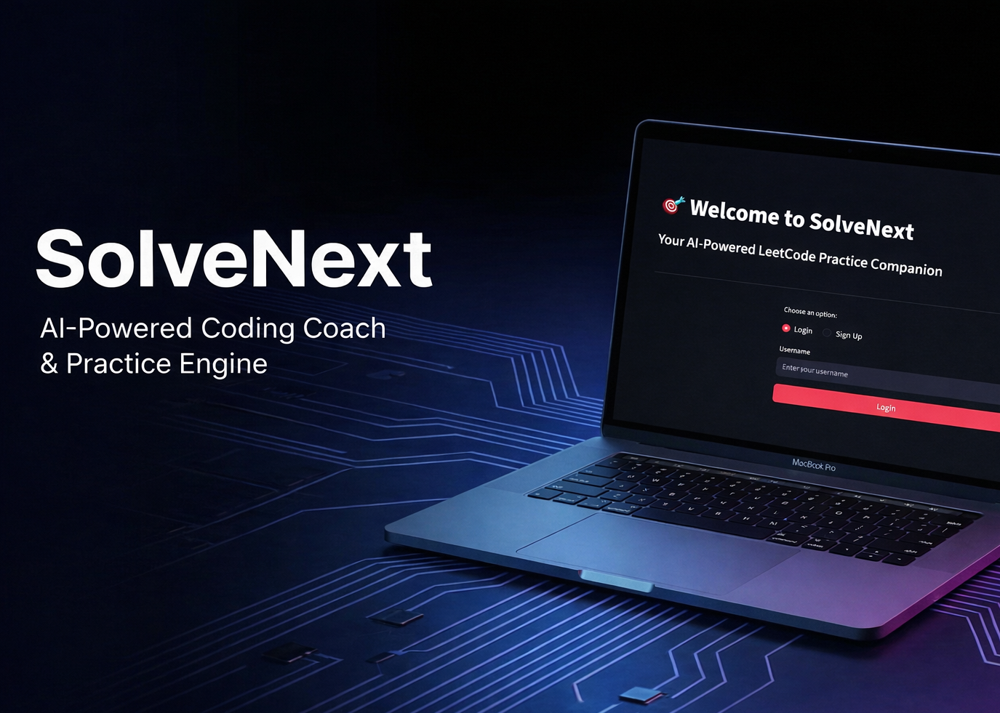
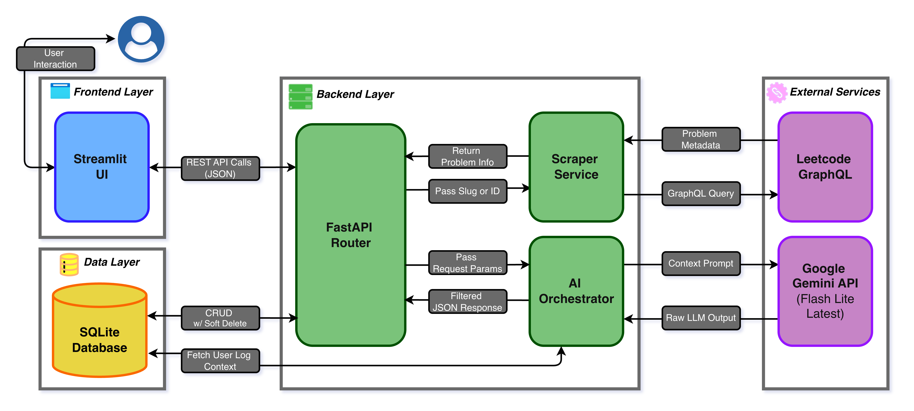

# SolveNext

[](https://example.com)
[](https://example.com)
[](https://example.com)

> **The AI-Powered Coding Coach & Practice Engine.** > **Stop grinding blindly. Start practicing smartly.**
> 
[SolveNext Demo Video](https://www.youtube.com/watch?v=T2RkpJAlDSA)
[](https://www.youtube.com/watch?v=T2RkpJAlDSA)

---

## The Problem: The Broken "Blind Grinding"

The traditional approach to technical interview preparation is fundamentally broken:
* **The Tracking Burden**: Manually analyzing your weak spots and finding similar problems to reinforce them is a time-consuming chore.
* **Directionless Grinding**: Randomly solving problems is a waste of time. Static problem lists don't adapt to your dynamic skill level.
* **The Guidance Gap**: Official hints are often vague or missing. Jumping straight to the full solution ruins the learning process.

---

## The Solution: Intelligent Navigation

SolveNext replaces random problem-solving with an adaptive, AI-driven practice loop:

* **Diagnostic Proficiency Tracking**: Leveraging your practice logs, the system automatically diagnoses your weak spots and details exactly which concepts to reinforce.
* **Context-Aware Recommendation**: By analyzing your logs alongside custom filters (Topic, Difficulty, Company), the AI precisely recommends the most suitable challenges.
* **Structured LLM Guidance**: Replaces vague official hints with a 3-tier LLM system (Concept → Approach → Implementation), delivering the exact nudges you need to build intuition without spoilers.

---

## The Impact: Maximum Practice Efficiency

* **Automate the Heavy Lifting**: No more manual self-analysis. The system automatically pinpoints your weak spots so you don't have to.
* **Hyper-Efficient Practice**: Focus strictly on the challenges you actually need, eliminating the wasted time of random problem-solving.
* **Structured Problem-Solving**: Build clear algorithmic intuition. Progressive AI nudges guide your logic step-by-step instead of just giving away the code.

---

### System Architecture



---

## Installation & Setup

### Step 1: Clone the repo
```bash
git clone <https://github.com/noooah2000/solve-next>
cd SolveNext
```

### Step 2: Backend Setup
```bash
cd backend
pip install -r requirements.txt
```

Create a `.env` file in the project root:
```text
GEMINI_API_KEY=your_api_key_here
```

Start the backend:
```bash
uvicorn main:app --reload
```

### Step 3: Frontend Setup
```bash
cd ../frontend
pip install -r requirements.txt
streamlit run app.py
```

---

## AI Disclosure

This project uses **Google Gemini API (Flash Lite Latest)** to generate progressive hints and adaptive problem recommendations. All AI outputs are generated dynamically based on the user's explicit practice history and context.

---

## Author

**Noah Huang** | Solo Developer

---
If you like this project or find it helpful for your interview prep, please consider giving it a ⭐️!
